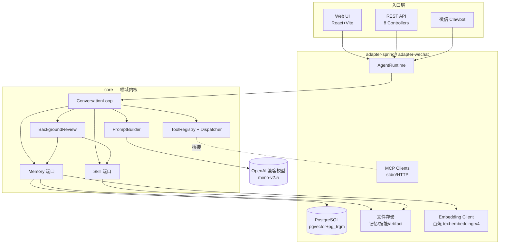
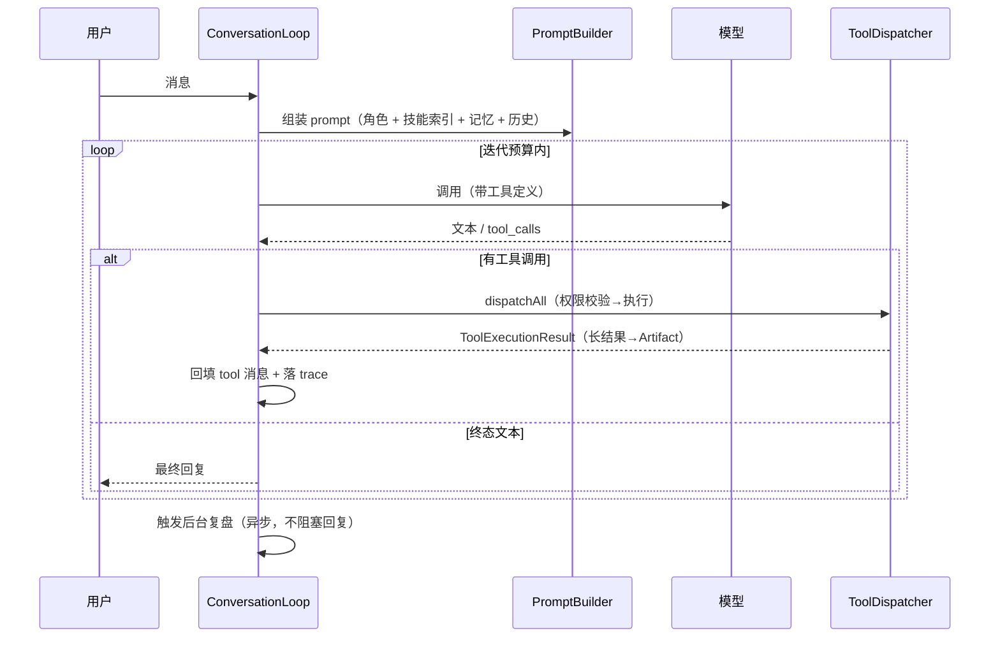
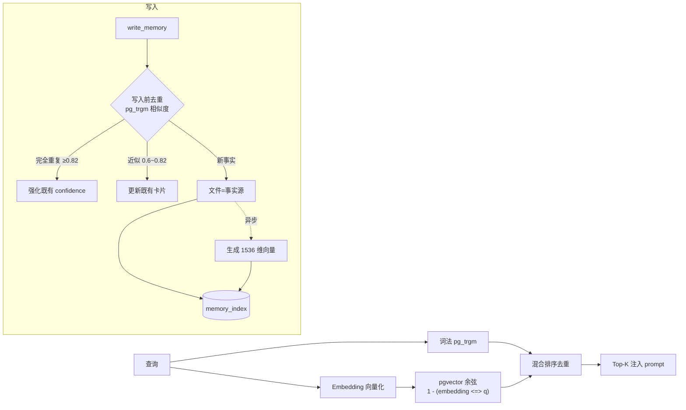
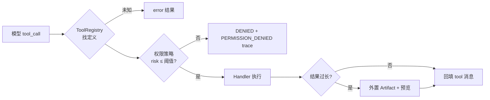

# MiraAgent

> 一个**可定义人设的通用 Agent**：有状态、多轮、可工具调用的 Agent Core，叠加角色卡身份层、长期记忆与自我改善能力。陪伴只是它的一种人设，内核是一套通用的 Agent 运行时。

MiraAgent 用 Java 21 + Spring Boot 实现了一条完整的 Agent 主链路——从角色身份注入、多轮对话循环、工具调用与权限治理，到长期记忆（向量 + 词法混合检索）、长上下文压缩、技能（Skill）沉淀与后台复盘自我改善，并通过 Web UI、REST API、微信三个入口对外服务，工具生态可经 MCP 协议扩展。

---

## ✨ 能力总览

| 维度 | 能力 |
|---|---|
| **Agent Core** | 多轮对话循环、工具调用编排、迭代预算、可中断 run、流式输出（SSE） |
| **角色系统** | 角色卡导入、身份层 prompt 注入（角色优先于技能/记忆，保稳定前缀缓存） |
| **长期记忆** | 文件即事实源 + DB 索引；pgvector 向量 + pg_trgm 词法混合检索；写入前去重(同事实不重复建卡)；逻辑删除/封类 |
| **长上下文** | 双水位触发压缩、摘要检查点、与记忆协同 |
| **工具系统** | 统一 ToolRegistry / 风险分级 / 权限策略 / trace / 长结果 Artifact 外置 |
| **自我改善** | Skill 渐进式披露 + 使用统计 + 去重；后台复盘（双门控）按来源定 confidence 提炼记忆/技能；Curator 归档/合并建议 |
| **工具生态** | calculator / web_fetch / file_read / file_write + note / todo；**MCP 接入**（stdio/HTTP） |
| **入口** | Web UI（React，含 Trace 调试页）、REST API、微信 Clawbot |

---

## 🏛️ 架构

六边形（端口-适配器）分层：`core` 只定义领域模型与端口接口 + 默认/内存实现；`adapter-spring` 提供 DB/文件/HTTP 适配与 Spring 装配；`adapter-wechat-clawbot` 是 IM 入口。**所有入口都经 `AgentRuntime`，不复制第二套 Loop。**



### 模块

| 模块 | 职责 |
|---|---|
| `core` | Agent 内核：`agent` / `model` / `prompt` / `tools` / `memory` / `skill` / `experience` / `mcp` / `character` / `session` / `trace` 端口与默认实现 |
| `adapter-spring` | Spring Boot 应用：REST API、MyBatis-Plus 持久化、pgvector 检索、文件存储、Embedding、MCP 传输、Web UI |
| `adapter-wechat-clawbot` | 微信入口：扫码登录、轮询、用户↔session 映射、消息转换 |
| `shared-test` | 测试夹具 |

---

## 🔄 Agent Loop



要点：prompt **稳定前缀**（角色身份）在前以利缓存；技能只注入索引、正文按需加载（渐进式披露）；工具异常一律转 `ToolExecutionResult(status=error)`，绝不穿透 loop。

## 🧠 记忆检索流程



文件是事实源，DB 是可重建索引；删除走逻辑删除（archived 标记，不重建）。**写入前按 `user+character+category` 做 pg_trgm 相似度去重**：完全重复（≥0.82）只强化既有 confidence、近似（0.6~0.82）更新既有卡片、否则才新建，同一事实不再重复堆卡；阈值可配（`memory.dedup.*`），异常一律退化为正常写入不阻断主流程。

## 🛠️ 工具调用与权限



风险分级 LOW/MEDIUM/HIGH/CRITICAL；默认放行阈值 MEDIUM，危险工具（如 `file_write` HIGH）默认被门控，需显式抬高 `mira.tools.max-risk-level` 才放行。**MCP 工具经 `McpToolRegistryBridge` 注册进同一个 ToolRegistry，复用同一套权限/trace/artifact，不是旁路。**

---

## 🧰 技术栈

Java 21 · Maven 多模块 · Spring Boot 3.5.6 · MyBatis-Plus 3.5.7 · PostgreSQL + pgvector + pg_trgm · OpenAI 兼容模型直连（RestClient/JDK HttpClient，不用 Spring AI）· 阿里百炼 text-embedding-v4(1536) · Jackson · Lombok · JUnit 5 · 虚拟线程 · 前端 Vite + React + TypeScript。

---

## 🚀 快速开始

> 系统默认 JDK 为 17，需指定 JDK 21。

```bash
# 测试（根 reactor）
JAVA_HOME=/opt/homebrew/opt/openjdk@21 ./mvnw test

# 本地启动（先 install 再跑 adapter-spring）
JAVA_HOME=/opt/homebrew/opt/openjdk@21 ./mvnw install -DskipTests
JAVA_HOME=/opt/homebrew/opt/openjdk@21 ./mvnw spring-boot:run -pl adapter-spring -Dspring-boot.run.profiles=local

# 前端
cd MiraAgent/web-ui && npm run dev   # http://localhost:5173，代理到 8080
```

关键环境变量（或写入 gitignored 的 `application-local.yaml`）：`MIRA_MODEL_API_KEY`、`MIRA_MODEL_BASE_URL`、`MIRA_MODEL_NAME`、`MIRA_DB_URL/USERNAME/PASSWORD`、`mira.embedding.*`（配 base-url 触发 Embedding 装配）。无 DB 时自动降级到内存/文件实现。

### API Demo（curl）

```bash
# 普通对话
curl -s localhost:8080/api/chat -H 'Content-Type: application/json' -d '{
  "userId":"u1","characterId":"mira","content":"帮我算 (3+4)*2",
  "enabledTools":["calculator"]
}'

# 流式（SSE：start/trace/text_delta/tool_call/tool_result/done）
curl -N localhost:8080/api/chat/stream -H 'Content-Type: application/json' -d '{
  "userId":"u1","characterId":"mira","content":"你好","stream":true
}'

# 查 trace / 工具执行 / 记忆
curl -s localhost:8080/api/traces/{runId}
curl -s localhost:8080/api/tool-executions/runs/{runId}
curl -s 'localhost:8080/api/memory?userId=u1'
```

REST 路由一览：`/api/chat`、`/api/chat/stream`、`/api/runs/{id}/interrupt`、`/api/sessions/{id}/messages`、`/api/characters`(列表/查看/导入)、`/api/memory`(GET/DELETE/ban-category)、`/api/traces/{runId}`、`/api/tool-executions/*`、`/api/skills/*`(列表/查看/归档/pin/curator-report)、`/api/health`。

### 一键 Demo

```bash
# 服务起好后（profile=local），另开终端：
./MiraAgent/scripts/demo/run-demo.sh   # 需 curl + jq
```

学习搭子「小研」陪用户规划复习的完整链路：角色卡 → 写入长期记忆 → 调用 todo 工具 → 跨轮 session/记忆召回 → Background Review 沉淀学习规划 skill，每步打印对应数据/trace 变化。详见 [`scripts/demo/`](MiraAgent/scripts/demo/)（含可落盘的示例记忆/skill）。

### 启用 MCP

在 `application-local.yaml` 配置（默认关闭）：

```yaml
mira:
  mcp:
    enabled: true
    servers:
      - id: demo
        type: stdio
        command: python3
        args: [ "scripts/mcp/echo_mcp_server.py" ]   # 自带零依赖示例 server
```

启动后，MCP 工具以 `mcp__<server>__<tool>` 命名进入统一工具列表，对模型可见、可调用、可回填、可在 trace 中查看。

---

## 📂 目录

```
MiraAgent/
├── core/                    # Agent 内核（端口 + 默认实现）
├── adapter-spring/          # Spring Boot 应用 + Web UI + 持久化 + MCP 传输
├── adapter-wechat-clawbot/  # 微信入口
├── shared-test/             # 测试夹具
└── scripts/mcp/             # 示例 MCP server
```

---

## 🎤 面试速答清单

围绕这些点都能展开讲实现：

1. **Agent Loop 怎么设计的？** ConversationLoop 的迭代预算、tool_call 回填顺序、终态判定、可中断、流式事件。
2. **工具系统如何统一治理？** ToolRegistry + Dispatcher + 风险分级 + 权限策略 + trace + 长结果 Artifact 外置；MCP 如何桥接进同一套而非旁路。
3. **记忆为什么"文件即事实源 + DB 索引"？** 可重建、可审计、删除走逻辑删除；向量(pgvector 余弦) + 词法(pg_trgm) 混合检索；为何 embedding 用百炼而模型用 mimo。
4. **长上下文怎么压缩？** 双水位触发、摘要检查点、与记忆协同，避免无界增长。
5. **自我改善怎么做的？** 技能渐进式披露（索引进 prompt、正文按需）、单写者串行化保文件安全、去重再创建、隐私物理隔离（技能 schema 无用户事实字段）、按来源定 confidence；后台复盘双门控（工具数/信号词/轮数）异步提炼，Curator 归档/合并建议。
6. **分层与可移植性？** 六边形端口-适配器，core 零 Spring/DB 依赖，无 DB 自动降级到内存/文件实现。
7. **微信入口的边界？** 经同一 AgentRuntime、能恢复历史 session，但只发"角色作为人"的正式回复，不暴露工具/思考/skill/trace。

---

## 📌 进度

- **P0** Agent Core 闭环 ✅ ｜ **P1** Memory 与长上下文 ✅ ｜ **P2** Skills 与自我改善 ✅（真实链路联调通过）
- **P3** 生态扩展：MCP 接入 ✅ · 常用工具包 ✅ · README/架构材料 ✅ · 角色卡仓库 + Demo 脚本 ✅ · Web UI 技能管理页 ✅ · 微信入口 ✅
- **持续优化**：风格约束（StyleConstraint）· 评测体系（eval 模块 + Dashboard）· 记忆写入前去重
